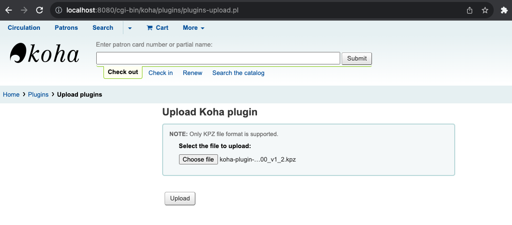
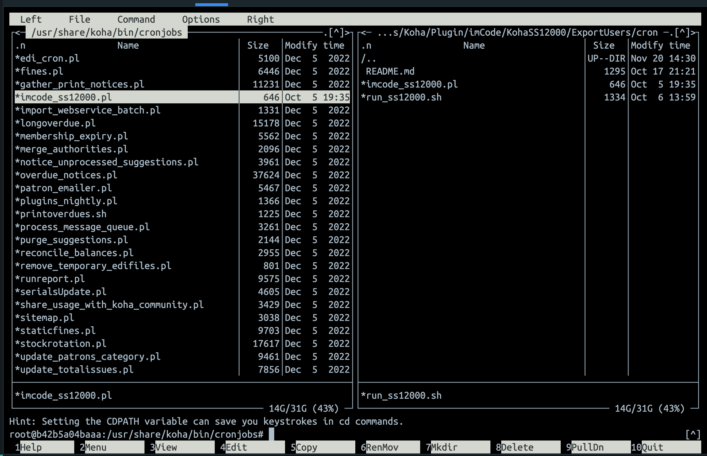
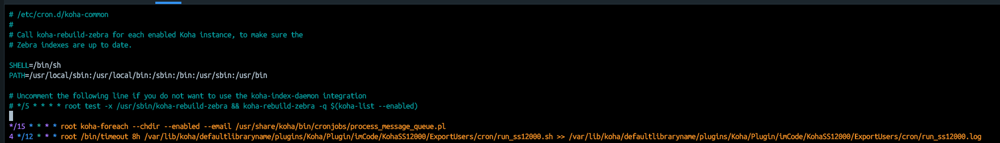
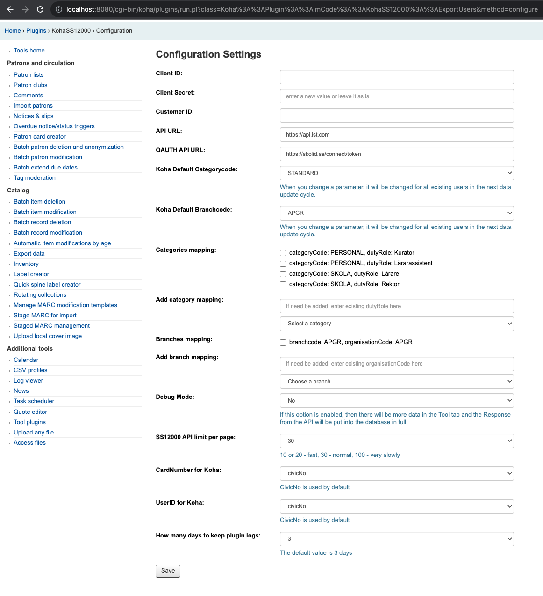
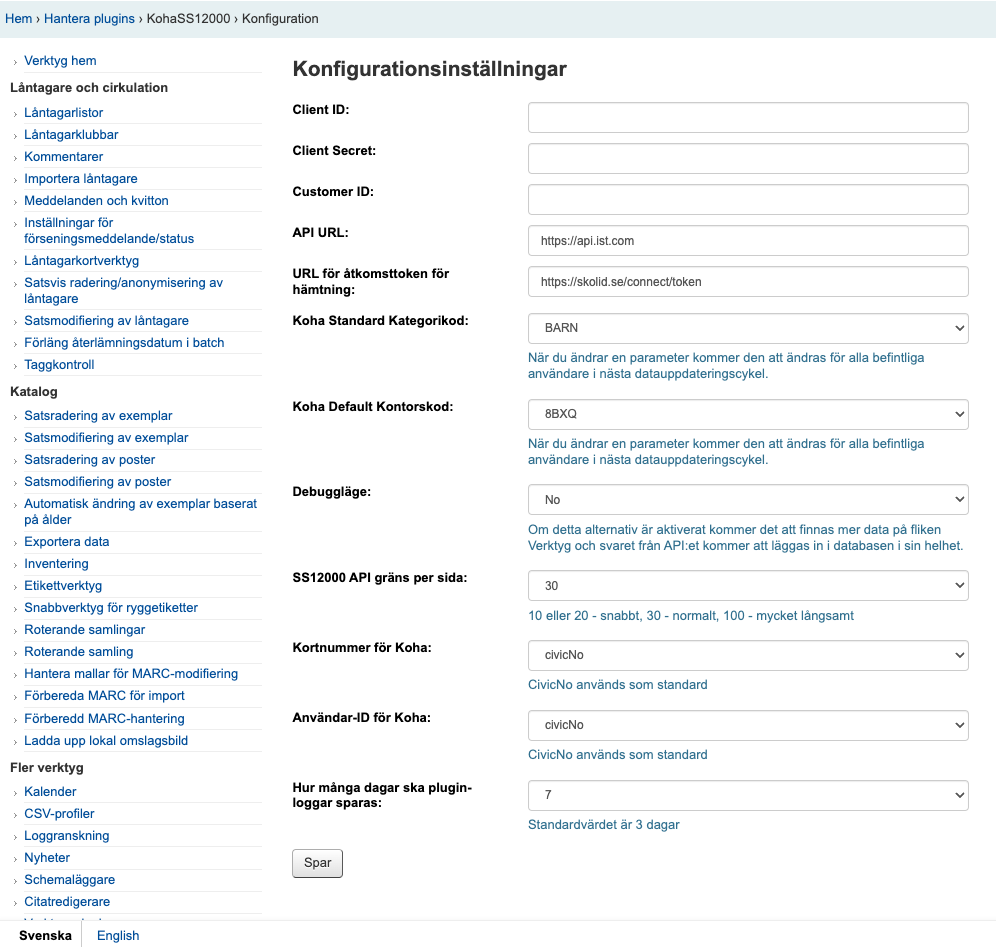

# KOHASS12000


This is a plugin for [Koha](https://github.com/Koha-Community/Koha) by [imCode](https://imcode.com)

It exports user data from the API in SS12000 format to your Koha database

Plugin and cron jobs for importing SS12000 v 1.75

[SS12000 Fields Specification](Doc/SS12000_Fields_Specification.md)

2025-09-04, 22:27

[1.75 version of koha-plugin-export-users_ss12000](https://github.com/imCodePartnerAB/KOHASS12000/releases/tag/v1.75)


# KohaSS12000 › Installation and CRON

1. Add the [latest version of the plugin](https://github.com/imCodePartnerAB/KOHASS12000/releases) to Koha



2. Run this command on a server running Koha:
```
sudo service memcached restart ; sudo service koha-common restart
```
3. Put perl script [Koha/Plugin/imCode/KohaSS12000/ExportUsers/cron/imcode_ss12000.pl](Koha/Plugin/imCode/KohaSS12000/ExportUsers/cron/imcode_ss12000.pl) to 
```
/usr/share/koha/bin/cronjobs
```


4. Shell script [run_ss12000.sh](Koha/Plugin/imCode/KohaSS12000/ExportUsers/cron/run_ss12000.sh)

Examples of use in cron:
```
4 */12 * * * root /bin/timeout 8h /var/lib/koha/defaultlibraryname/plugins/Koha/Plugin/imCode/KohaSS12000/ExportUsers/cron/run_ss12000.sh 
```


**run_ss12000.sh** - the script has protection against re-running. It also has a runtime limit, which is **8 hours by default**.

5. After you've added a script call to cron, you need to restart cron on the server running Koha:
```
sudo /etc/init.d/cron restart
```

# KohaSS12000 › Configuration




If you need to start parsing data right now and don't want to wait for the script to be called through the cron, run this command on the server:
```
/var/lib/koha/defaultlibraryname/plugins/Koha/Plugin/imCode/KohaSS12000/ExportUsers/cron/run_ss12000.sh 
```

**defaultlibraryname** - this should be the name you gave when installing Koha


Make your GitHub documentation look good, use [writing-on-github](https://docs.github.com/en/get-started/writing-on-github/getting-started-with-writing-and-formatting-on-github/basic-writing-and-formatting-syntax)
